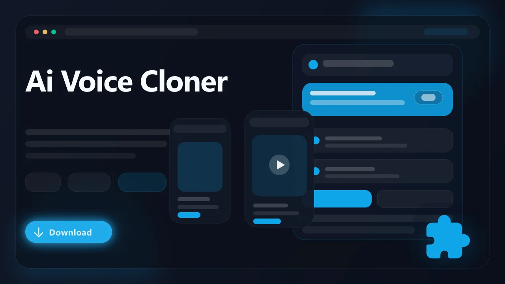

# AI Voice Cloner — Coming Soon (Browser Extension)

> Clone voices from any audio or video playing in your browser using AI-powered voice synthesis. **This extension is currently in development and has not been released yet.**

AI Voice Cloner is an upcoming browser extension that will let users capture a voice sample from any media playing in the browser and use it to generate new speech in that cloned voice. It is being built entirely around in-browser workflows so you can sample, clone, and synthesize voices without leaving your tab or installing standalone software.

- Capture voice samples from any audio or video playing in the browser
- Generate natural-sounding speech in a cloned voice from a text prompt
- Work with voices from podcasts, interviews, lectures, and other spoken media
- Fine-tune voice characteristics like tone, pacing, and emphasis
- Designed for Chrome, Edge, Brave, Opera, Firefox, and other Chromium browsers

## Status

**This extension is not yet available for download.** Development is in progress and a release date has not been announced. Sign up below to get notified when it launches.

:bell: **Get notified when this launches:** [Join the waitlist](https://serp.ly/coming-soon-extensions)

## Links

- :hourglass_flowing_sand: Waitlist: [Coming Soon — Sign Up](https://serp.ly/coming-soon-extensions)
- :question: Help center: [SERP Help](https://help.serp.co/en/)
- :bulb: Request features: [GitHub Issues](https://github.com/serpapps/ai-voice-cloner/issues)

## Preview

## Table of Contents

- [Why AI Voice Cloner](#why-ai-voice-cloner)
- [Planned Features](#planned-features)
- [How It Will Work](#how-it-will-work)
- [Expected Formats](#expected-formats)
- [Who It's For](#who-its-for)
- [Use Cases We're Building For](#use-cases-were-building-for)
- [FAQ](#faq)
- [License](#license)
- [Notes](#notes)
- [About AI Voice Cloning](#about-ai-voice-cloning)

## Why AI Voice Cloner

Most voice cloning tools today require you to record samples in a separate app, upload files to a cloud service, and then copy the generated audio back to wherever you actually need it. The process is fragmented and pulls you out of the content you were listening to in the first place.

AI Voice Cloner is being designed to keep the entire workflow inside the browser. The goal is to let you highlight a section of audio playing in any tab, extract the vocal characteristics from that segment, and immediately generate new speech using that voice profile — all without leaving the page or managing files across multiple applications.

## Planned Features

- Real-time voice sampling from any audio or video source playing in the browser
- AI-driven voice model generation from short audio segments
- Text-to-speech synthesis using a cloned voice profile
- Adjustable parameters for pitch, speed, and vocal inflection
- Voice profile library to save and reuse cloned voices across sessions
- Audio preview before exporting so you can refine the output
- Browser-native pipeline with no external software dependencies
- Cross-browser compatibility targeting Chrome, Edge, Brave, and Firefox

## How It Will Work

1. Install the extension once it is released.
2. Navigate to any page with audio or video content playing in the browser.
3. Open the extension popup and begin capturing a voice sample from the active tab.
4. Select a segment of speech that best represents the voice you want to clone.
5. Let the AI engine analyze the sample and build a voice profile.
6. Enter or paste the text you want spoken in the cloned voice.
7. Adjust voice parameters like speed, pitch, or emphasis if needed.
8. Generate the speech, preview the result, and export the audio file.

## Expected Formats

- Input: Any browser-playable audio or video source (MP3, AAC, WebM, OGG, MP4, HLS streams)
- Output: WAV or MP3 files of the synthesized speech

Generated audio will be saved in standard formats compatible with most media players, video editors, and audio production tools.

## Who It's For

- Content creators who need voiceovers that match a specific vocal style
- Developers prototyping voice interfaces or audio features for applications
- Educators producing narrated course material with a consistent voice
- Podcasters and streamers looking for quick voice mockups or draft reads
- Hobbyists experimenting with AI-generated speech for personal projects

## Use Cases We're Building For

- Clone a narrator's voice from a documentary to draft a voiceover script
- Generate placeholder dialogue in a specific vocal style for a video project
- Reproduce your own voice from a recorded lecture to narrate new slides
- Create consistent AI narration across a series of tutorial videos
- Sample a voice from a podcast interview and test how new copy sounds in that tone

## FAQ

**When will AI Voice Cloner be released?**
A release date has not been set. Sign up at the waitlist link above to be notified as soon as it is available.

**How long of a voice sample does it need?**
The target is to produce a usable voice clone from as little as ten to fifteen seconds of clear speech, though longer samples will improve accuracy.

**Will cloned voices sound exactly like the original?**
The AI model will approximate the vocal characteristics of the source sample. Results will vary depending on sample quality, background noise, and the complexity of the voice.

**Does it work with any language?**
Multi-language support is planned, but initial development is focused on English. Additional languages will be evaluated based on demand and model capability.

**Is it free?**
Pricing details will be announced closer to launch. SERP extensions typically include a free trial period.

**Where does the voice processing happen?**
The architecture is still being finalized. Some processing may happen locally in the browser while heavier model inference may require a cloud component.

## License

This repository is distributed under the proprietary SERP Apps license in the [LICENSE](LICENSE) file. Review that file before copying, modifying, or redistributing any part of this project.

## Notes

- This extension is in development and is not available for download yet
- Only clone voices you have the right or permission to use
- Output quality will depend on the clarity and length of the source voice sample
- Browser security policies and platform updates may affect audio capture capabilities
- An active internet connection may be required for AI model inference

## About AI Voice Cloning

AI voice cloning is a branch of speech synthesis that uses machine learning to replicate the vocal characteristics of a specific speaker. Traditional text-to-speech engines produce generic robotic output, while voice cloning models learn the unique qualities of a real voice — its timbre, cadence, and inflection — and reproduce them in new speech. AI Voice Cloner is being built to bring that technology directly into the browser so users can sample and synthesize voices without specialized software or technical expertise.
